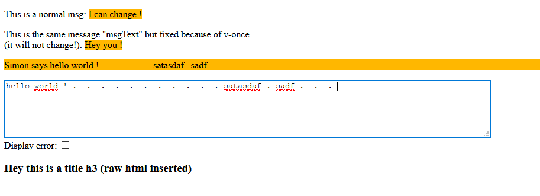
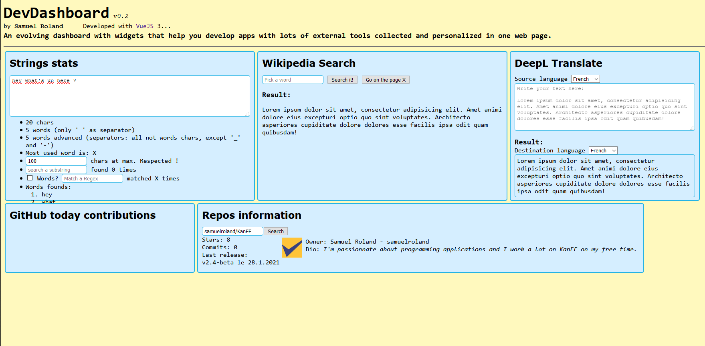

# Vue-Sandbox
A repo to store very little apps with VueJS 3 to learn by practice... because I'm starting to learn Vue at start of 2021.

These are my first essay with this javascript frameworks so please be indulgent... My skills and habits with this framework will probably change in the future.

### Do you want to learn VueJS too ?
Here are ressources that helped me to learn:
- [Official documentation for v3](https://v3.vuejs.org/guide/introduction.html)

## List of applications
### Hello world:
Only to train basic attribute like v-if, v-bind, v-model, ...

### DevDashoard:
An app with useful and useless little tools included:

- Implemented Widgets:
    - Strings stats: paste a string and get statistics on it (useful when developping app with limited char field, or writing tests data)
    - Repos information: get basic information of a repos and its owner
